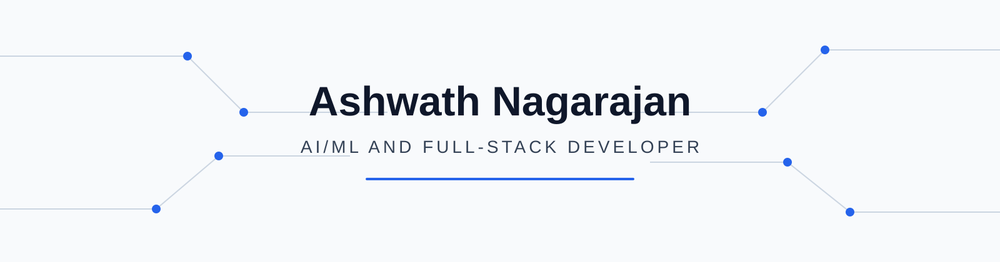
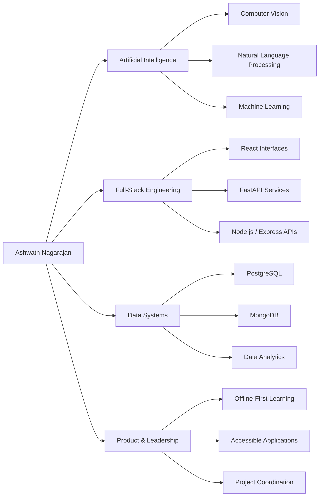
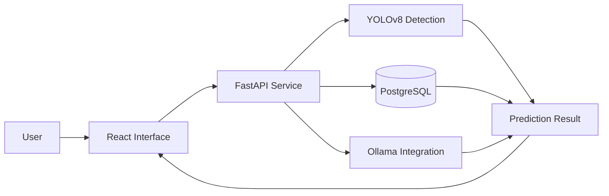
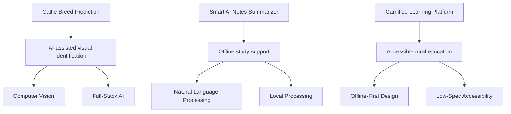

<!--
  GitHub Profile README for Ashwath Nagarajan
  Replace every YOUR_* placeholder before publishing.
-->

<picture>
  <source media="(prefers-color-scheme: dark)" srcset="assets/profile-banner-dark.svg">
  <source media="(prefers-color-scheme: light)" srcset="assets/profile-banner-light.svg">
  
</picture>

 

# Ashwath Nagarajan

### AI/ML and Full-Stack Developer

Building practical AI systems, data-driven applications, and accessible digital products with Python, React, FastAPI, and modern machine-learning frameworks.

  
  
  
  

---

## Professional Snapshot

<table>
<tr>
<td width="50%" valign="top">

### Academic Identity

**B.Tech — Artificial Intelligence and Data Science**  
Kongu Engineering College, Perundurai  
Expected graduation: **2028**  
CGPA: **8.64 through Semester 4**

</td>
<td width="50%" valign="top">

### Technical Direction

**Primary focus:** AI/ML and full-stack development  
**Applied domains:** Computer vision, NLP, data science  
**Engineering interests:** Data analytics, machine learning, data engineering  
**Product focus:** Practical, scalable, offline-capable applications

</td>
</tr>
<tr>
<td width="50%" valign="top">

### Experience

**Frontend Intern** — Pranav Techy  
**MERN Stack Developer** — Tekriq Technologies  
Applied React, Vite, Node.js, Express.js, MongoDB, SMTP integration, and AI-assisted web functionality.

</td>
<td width="50%" valign="top">

### Leadership

**Coding Forum Secretary** — 2026–27  
**Student Project Coordinator** — 2025–26  
**Cloud User Groups Executive Member** — 2025–26

</td>
</tr>
</table>

---

## Technical Identity

---

## Technology Stack

<table>
<tr>
<td align="center" width="25%"><strong>Programming</strong></td>
<td align="center" width="25%"><strong>Frontend</strong></td>
<td align="center" width="25%"><strong>Backend</strong></td>
<td align="center" width="25%"><strong>Databases</strong></td>
</tr>
<tr>
<td align="center" valign="top">

 

</td>
<td align="center" valign="top">

</td>
<td align="center" valign="top">

</td>
<td align="center" valign="top">

</td>
</tr>
</table>

<table>
<tr>
<td align="center" width="50%"><strong>AI, Machine Learning and Data</strong></td>
<td align="center" width="50%"><strong>Engineering Tools</strong></td>
</tr>
<tr>
<td align="center" valign="top">

</td>
<td align="center" valign="top">

</td>
</tr>
</table>

---

## Experience

<table>
<tr>
<td width="22%" valign="top">

### 2026

**Apr — Jul**

</td>
<td width="78%" valign="top">

### MERN Stack Developer — Tekriq Technologies

`JavaScript` `React` `Node.js` `Express.js` `MongoDB` `SMTP` `Groq API`

- Developed a responsive interior-design website with separate public and administrative interfaces.
- Built backend services for website content, enquiries, projects, and administrative data.
- Integrated customer-enquiry email delivery and automated visitor assistance.

</td>
</tr>
<tr>
<td width="22%" valign="top">

### 2026

**Jan — Mar**

</td>
<td width="78%" valign="top">

### Frontend Intern — Pranav Techy

`React` `Vite` `ESLint` `HMR` `SWC/Babel`

- Engineered a responsive React application with more than 15 reusable UI components.
- Maintained a modular component structure and consistent code quality with ESLint.
- Improved the development workflow using Vite HMR and modern React tooling.

</td>
</tr>
</table>

---

## Featured Projects

<table>
<tr>
<td width="50%" valign="top">

### Cattle Breed Prediction System

**Problem**  
Breed identification requires a usable pipeline that connects visual detection with an accessible application.

**Solution**  
An AI web application combining YOLOv8 detection, a FastAPI service layer, PostgreSQL persistence, Ollama integration, and a scalable React frontend.

**Core stack**

**Capabilities:** visual breed detection, API-based processing, persistent data handling, local AI integration.

</td>
<td width="50%" valign="top">

### Smart AI Notes Summarizer

**Problem**  
Students need efficient note processing without depending continuously on cloud-based services.

**Solution**  
An offline NLP system for summarization, quiz generation, and multimedia-supported learning using lightweight processing.

**Core stack**

**Capabilities:** notes summarization, quiz generation, lightweight offline processing, multimedia learning support.

</td>
</tr>
<tr>
<td width="50%" valign="top">

### Gamified Learning Platform

**Problem**  
Rural learners may face low-spec hardware, weak connectivity, and limited access to engaging digital learning.

**Solution**  
An offline-first educational platform using lightweight web technologies, SVG-based interactions, and gamified learning experiences.

**Core stack**

**Capabilities:** offline use, SVG learning interactions, low-spec optimization, accessibility-oriented design.

</td>
<td width="50%" valign="top">

### Project Portfolio Pattern

| Dimension | Evidence |
|---|---|
| AI systems | YOLOv8 detection and NLP processing |
| Full-stack delivery | React interfaces with API and database layers |
| Local capability | Ollama integration and offline NLP |
| Social relevance | Rural education and accessible learning |
| Engineering focus | Modular UI, scalable architecture, low-spec optimization |

 

</td>
</tr>
</table>

---

## Selected Project Architecture

<strong>Architecture represented above</strong>

The diagram visualizes the résumé-supported components of the Cattle Breed Prediction System: React, FastAPI, YOLOv8, PostgreSQL, and Ollama. Deployment infrastructure is intentionally omitted because it is not specified in the résumé.

---

## Domain Strength Matrix

| Domain | Evidence-based level | Résumé evidence |
|---|---|---|
| Full-stack web development | Applied in Projects and Internship | MERN website, React applications, FastAPI projects |
| Frontend engineering | Applied in Internship | React, Vite, reusable components, ESLint, HMR |
| Computer vision | Applied in Project | YOLOv8 cattle breed detection |
| Natural language processing | Applied in Project | Offline notes summarization and quiz generation |
| Backend API development | Applied in Projects and Internship | FastAPI, Node.js, Express.js |
| Database systems | Applied in Projects and Internship | PostgreSQL and MongoDB |
| Data science and machine learning | Academic and Project Exposure | NumPy, Pandas, Scikit-learn, TensorFlow, Keras, PyTorch |
| Data engineering | Area of Interest | Listed technical interest |
| Technical leadership | Active Responsibility | Project coordination, coding forum, cloud community |

---

## Project Impact Map

---

## Certifications and Achievements

<table>
<tr>
<td width="50%" valign="top">

### Certifications

- **IBM Generative AI**
- **NASSCOM Data Processing and Visualisation**
- **Infosys JavaScript**

</td>
<td width="50%" valign="top">

### Achievements

- **First Prize** — Hybrid Coding Streak
- **Runner-up** — Thinkathon 2k26
- **Runner-up** — Eareyse 2k26

</td>
</tr>
</table>

---

## Leadership and Community

| Period | Responsibility | Focus |
|---|---|---|
| 2026–27 | Coding Forum Secretary | Technical community leadership |
| 2025–26 | Student Project Coordinator | Student project coordination |
| 2025–26 | Cloud User Groups Executive Member | Cloud-focused community involvement |

---

## Current Focus

<table>
<tr>
<td align="center" width="33%">

### Building

AI-enabled full-stack applications with practical interfaces, API layers, and persistent data systems.

</td>
<td align="center" width="33%">

### Exploring

Machine learning, data analytics, data engineering, computer vision, and NLP.

</td>
<td align="center" width="33%">

### Collaborating

`YOUR_CURRENT_COLLABORATION_INTERESTS`

</td>
</tr>
</table>

---

## GitHub Analytics

<picture>
  <source media="(prefers-color-scheme: dark)" srcset="https://github-readme-stats.vercel.app/api?username=AshwathNagarajan&show_icons=true&hide_border=true&theme=github_dark&rank_icon=github">
  <source media="(prefers-color-scheme: light)" srcset="https://github-readme-stats.vercel.app/api?username=AshwathNagarajan&show_icons=true&hide_border=true&theme=default&rank_icon=github">
  
</picture>

<picture>
  <source media="(prefers-color-scheme: dark)" srcset="https://github-readme-stats.vercel.app/api/top-langs/?username=AshwathNagarajan&layout=compact&hide_border=true&theme=github_dark&langs_count=8">
  <source media="(prefers-color-scheme: light)" srcset="https://github-readme-stats.vercel.app/api/top-langs/?username=AshwathNagarajan&layout=compact&hide_border=true&theme=default&langs_count=8">
  
</picture>

 

<picture>
  <source media="(prefers-color-scheme: dark)" srcset="https://streak-stats.demolab.com?user=AshwathNagarajan&theme=github-dark-blue&hide_border=true">
  <source media="(prefers-color-scheme: light)" srcset="https://streak-stats.demolab.com?user=AshwathNagarajan&theme=default&hide_border=true">
  
</picture>

 

<picture>
  <source media="(prefers-color-scheme: dark)" srcset="https://github-readme-activity-graph.vercel.app/graph?username=AshwathNagarajan&theme=github-dark&hide_border=true&area=true">
  <source media="(prefers-color-scheme: light)" srcset="https://github-readme-activity-graph.vercel.app/graph?username=AshwathNagarajan&theme=minimal&hide_border=true&area=true">
  
</picture>

> Analytics are dynamically generated from public GitHub activity and are not used as claims of expertise.

---

<!-- OPTIONAL SECTION: Remove this section and its workflow if you prefer a static profile. -->
## Contribution Visualization

<picture>
  <source media="(prefers-color-scheme: dark)" srcset="https://raw.githubusercontent.com/AshwathNagarajan/AshwathNagarajan/output/github-contribution-grid-snake-dark.svg">
  <source media="(prefers-color-scheme: light)" srcset="https://raw.githubusercontent.com/AshwathNagarajan/AshwathNagarajan/output/github-contribution-grid-snake.svg">
  
</picture>

<!-- END OPTIONAL SECTION -->

---

## Education

<table>
<tr>
<td width="20%" align="center">

</td>
<td width="80%">

**Bachelor of Technology in Artificial Intelligence and Data Science**  
Kongu Engineering College, Perundurai  
**2024–2028 · CGPA 8.64 through Semester 4**

</td>
</tr>
</table>

---

## Connect

---

### Engineering practical AI and full-stack products around real user needs.

Designed as a concise visual portfolio of verified education, experience, projects, skills, achievements, and leadership.

